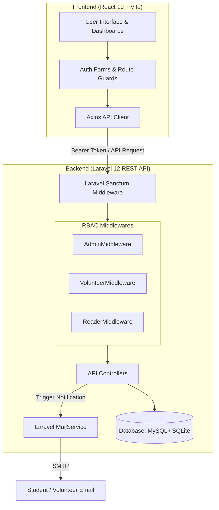

# 📚 DU Islamic Library (ঢাকা বিশ্ববিদ্যালয় ইসলামিক লাইব্রেরি)

[](https://laravel.com)
[](https://react.dev)
[](https://vitejs.dev)
[](https://tailwindcss.com)
[](https://php.net)
[](LICENSE)

> A full-stack, peer-to-peer Islamic library management and book-lending ecosystem tailored for Dhaka University students. Features role-based access control (RBAC), hall-wise inventory management, automated request-fulfillment workflows, email notifications, and a gamified reader reward system.

---

## 🌟 Quick Overview for Recruiters

**DU Islamic Library** is built to digitize and streamline the distribution of Islamic literature across residence halls and departments at the University of Dhaka. It bridges the gap between campus volunteers maintaining hall collections and student readers searching for authentic books.

### Key Engineering Highlights
- **Multi-Role Security Architecture**: Custom Laravel Sanctum API authentication with dedicated middleware layers (`AdminMiddleware`, `VolunteerMiddleware`, `ReaderMiddleware`).
- **Campus-Aware Domain Modeling**: Native support for Dhaka University's specific hall structures, departments, authors, categories, and hall-wise book physical copies (`BookCollection`).
- **Automated Book Request & Lending Lifecycle**: Complete state machine tracking book requests (`pending` -> `fulfilled` / `cancelled` -> `returned` / `lost`).
- **Gamified Engagement System**: Dynamic point economy granting/deducting points for timely returns, book reviews, reader registrations, and volunteer activities.
- **Modern UI/UX**: Built with **React 19**, **Tailwind CSS v4**, **Radix UI** accessible primitives, and fluid micro-animations powered by Framer Motion.
- **Transactional Email Service**: Integrated Laravel `MailService` for automated email notifications (book requests, verification, password resets).

---

## ✨ Key Features

### 👨‍🎓 Reader Portal (Students)
* **Catalog & Advanced Filtering**: Browse and search books by Title, Author, Category, Publisher, Hall availability, and Department.
* **Book Request Engine**: Request books directly from available campus hall inventories.
* **Personalized Dashboard**: Track borrowed books, pending requests, reading history, and total points earned.
* **Wishlist & Reviews**: Save books for later and publish reviews/ratings to earn community reward points.
* **Account & Security**: Secure authentication, profile management, and SMTP-driven password reset.

### 🤝 Volunteer Portal (Hall Managers)
* **Collection Management**: Manage hall-specific book physical copies and quantities (`BookCollection`).
* **Request Processing**: Review, approve, and fulfill book requests submitted by hall readers.
* **Lending & Return Tracker**: Handle book checkouts, process returns, update stock statuses, and mark unreturned items as lost.
* **Availability Toggle**: Mark volunteer availability for physical book exchanges.

### 🛡️ Admin Dashboard (Supervisors)
* **Volunteer Verification System**: Review and verify incoming volunteer registration applications.
* **Global Catalog Control**: Full CRUD operations for Books, Authors, Publishers, Categories, Halls, and Departments.
* **Reader & Inventory Monitoring**: Oversee reader accounts, book distributions, and overall system metrics.

---

## 🛠 Tech Stack

### Frontend
| Technology | Role |
| :--- | :--- |
| **React 19** | Modern component-driven UI library |
| **Vite 6** | Next-generation frontend tooling and HMR |
| **Tailwind CSS v4** | Utility-first styling with custom UI themes |
| **React Router v7** | Single Page Application (SPA) client-side routing |
| **TanStack Query v5** | Server-state management and caching |
| **React Hook Form + Zod** | Performant form state handling & schema validation |
| **Radix UI & Lucide** | Accessible UI primitives & modern icons |

### Backend
| Technology | Role |
| :--- | :--- |
| **Laravel 12 (PHP 8.2+)** | REST API framework |
| **Laravel Sanctum** | Stateful API token authentication |
| **Spatie Activity Log** | System audit trail & user activity logging |
| **Eloquent ORM** | Relational database mapping & queries |
| **Laravel Mail & SMTP** | HTML email notifications (Blade templates) |
| **MySQL / SQLite** | Relational database storage |

---

## 🏗 System Architecture & Workflow



---

## 📊 Core Database Models

| Model | Purpose |
| :--- | :--- |
| `Reader` | Student reader profile linked to university department & hall |
| `Volunteer` | Hall volunteer manager handling book distribution & verification |
| `Admin` | System administrator oversight |
| `Book` | Master book information (ISBN, title, description, cover image, category) |
| `BookCollection` | Maps specific book inventory counts to individual university halls |
| `Request` | Tracks book borrowing requests and fulfillment lifecycle |
| `Lending` | Manages active checkouts, return dates, and late penalty states |
| `PointSystem` | Defines reward rules for returning books, reviewing, or volunteering |
| `Hall` & `Department` | University structural entities for targeted localization |

---

## ⚡ Getting Started & Local Setup

### Prerequisites
- **PHP** `>= 8.2`
- **Composer** `>= 2.x`
- **Node.js** `>= 18.x` & **npm**
- **MySQL** or **SQLite**

---

### 1️⃣ Backend Setup (`laravel-backend`)

```bash
# Navigate to the backend directory
cd laravel-backend

# Install PHP dependencies
composer install

# Environment Configuration
cp .env.example .env

# Generate Application Key
php artisan key:generate

# Configure Database in .env (Default: SQLite or MySQL)
# Example for SQLite:
# DB_CONNECTION=sqlite

# Run Database Migrations & Seeders
php artisan migrate --seed

# Link Storage for Book Cover Uploads
php artisan storage:link

# Start the Laravel Backend API Server (http://localhost:8000)
php artisan serve
```

---

### 2️⃣ Frontend Setup (`frontend`)

```bash
# Navigate to the frontend directory
cd ../frontend

# Install Node dependencies
npm install

# Environment Configuration
cp .env.sample .env
# Ensure VITE_API_BASE_URL is set to http://localhost:8000/api

# Start Vite Development Server (http://localhost:5173)
npm run dev
```

---

## 📡 Key API Endpoints Overview

| Method | Endpoint | Access | Description |
| :--- | :--- | :--- | :--- |
| `POST` | `/api/register/reader` | Public | Reader account registration |
| `POST` | `/api/login/reader` | Public | Authenticate reader & return token |
| `GET` | `/api/books` | Public | List & search books with pagination |
| `POST` | `/api/request` | Reader | Submit a new book request |
| `GET` | `/api/reader/dashboard` | Reader | Fetch student dashboard & lending status |
| `PATCH`| `/api/request/fulfill` | Volunteer | Fulfill student book request |
| `PATCH`| `/api/lendings/return` | Volunteer | Mark book returned & assign reward points |
| `GET` | `/api/vol/unverified` | Admin | List pending volunteer verifications |
| `POST` | `/api/vol/verify` | Admin | Approve volunteer application |

---

## 📁 Repository Structure

```
DU_Islamic_Library/
├── laravel-backend/            # Laravel 12 Backend API
│   ├── app/
│   │   ├── Http/Controllers/   # Admin, Volunteer, Reader & Auth Controllers
│   │   ├── Http/Middleware/    # Role-Based Authorization Middlewares
│   │   ├── Models/             # Eloquent Models & Relationships
│   │   └── Services/           # MailService & Business Logic
│   ├── database/
│   │   ├── migrations/         # Database Schema Migrations
│   │   └── seeders/            # Initial Data Seeders
│   ├── routes/
│   │   └── api.php             # REST API Endpoint Definitions
│   └── resources/views/emails/ # Blade Email Templates
│
├── frontend/                   # React 19 + Vite Frontend
│   ├── src/
│   │   ├── components/         # Reusable UI & Admin/Volunteer Components
│   │   ├── pages/              # SPA Pages (Home, Browse, Dashboards)
│   │   ├── routes/             # Client-side Routing Definitions
│   │   └── utils/              # Axios API Wrapper & Helper Utilities
│   ├── public/                 # Static Assets
│   └── tailwind.config.js      # Tailwind Styling Configuration
│
└── README.md                   # Project Documentation
```

---

## 📜 License

Distributed under the **MIT License**. See `LICENSE` for more information.

---

<p align="center">
  Crafted with ❤️ for the Dhaka University Student Community.
</p>
